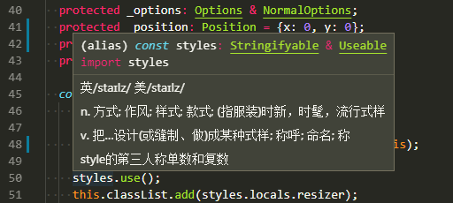
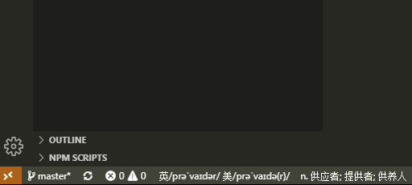
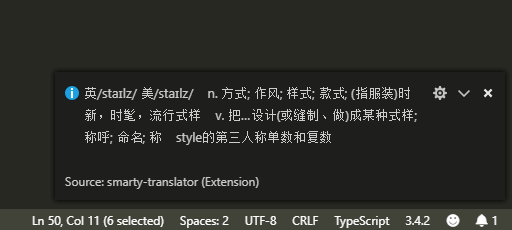

# 介绍

目前 vscode 插件市场的翻译插件多不胜数，大多也都是国人开发的，使用挺方便，但奈何自己的英语是散装版的，没有音标总感觉忐忑不安，众多插件中没有找到支持带音标的翻译插件，于是自己就做了一款。这款插件主要用来翻译单词，展示音标及详细的意思，对于长句也能翻译，但支持不太好。

1. 鼠标悬停



2. 状态栏显示 `(Display Mode: bar)`



3. 弹出框实现 `(Display Mode: popup)`



> 由于 vscode.window.showInformationMessage 内容不支持换行，支持的话这里格式化后看着会舒服很多，建议使用状态栏式显示。


## 使用

安装：[https://marketplace.visualstudio.com/items?itemName=sanonz.smarty-translator](https://marketplace.visualstudio.com/items?itemName=sanonz.smarty-translator)

设置

| Name | Type | Default | Required | Description |
| --- | --- | --- | --- | --- |
| Display Mode | `enum` | `bar` | `true` | 翻译显示方式：`bar` 为显示到底部的状态栏，popup 为弹窗显示，具体请看上方的截图 |
| From Language | `string` | `auto` | `true` | 要翻译的语言为什么语言，`auto` 为自动检测语言推荐使用 |
| To Language | `string` | `zh` | `true` | 要翻译为什么语言 |
| duration | `number` | `30000` | `true` | 弹窗显示时间，为 0 则不会自动关闭，只对 `Display Mode = bar` 时生效 |
| Use Auto Match | `boolean` | `true` | `true` | 鼠标悬停时未选择单词是否触发翻译，此选项可减少翻译结果弹出过于频繁，影响阅读弹窗其它内容的问题 |

命令

| Name | Description | Keyboard Shortcuts |
| --- | --- | --- |
| extension.smartyTranslate | 触发翻译，需要先使用光标选择一个单词 | window(cmd+shift) + T |


## 开发

克隆项目仓库

```bash
$ git clone git@github.com:sanonz/vscode-extension-smarty-translator.git
$ cd vscode-extension-smarty-translator
```

安装依赖包

```bash
$ npm install
```

选择：`Debug -> Run Extension`，会弹出一个新的 vscode 窗口，这个窗口已经内置了这款插件，打开一个项目 pick 一个单词，不出意外会有翻译结果出来。
